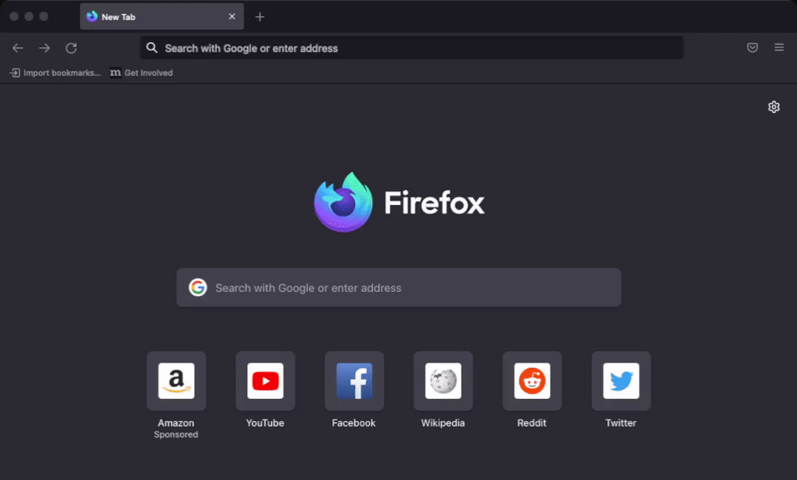
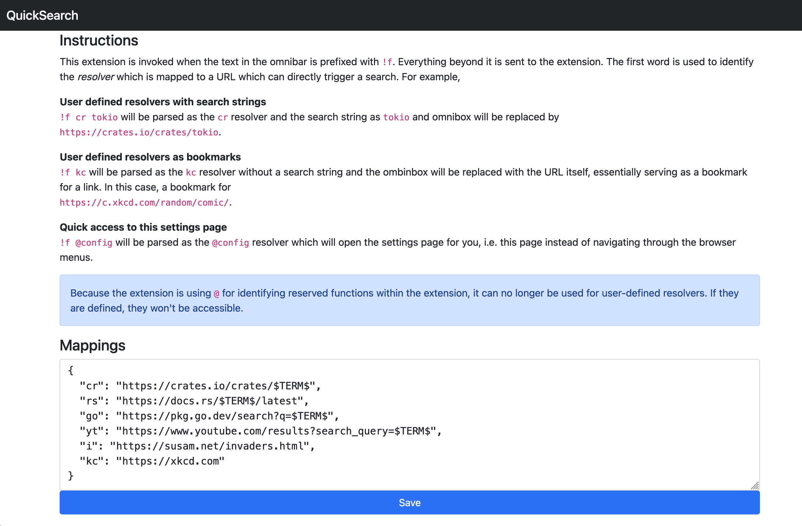

# QuickSearch

A [omnibox](https://developer.mozilla.org/en-US/docs/Mozilla/Add-ons/WebExtensions/API/omnibox)
extension which implements `!g` style search redirections implemented in
[DuckDuckGo](duckduckgo.com/) but locally.

> **This extension is still in beta but is usable though**

---

## Demo

A small demonstration with the default aliases.



---

## How does it work

This extension leverages the [omnibox](https://developer.mozilla.org/en-US/docs/Mozilla/Add-ons/WebExtensions/API/omnibox)
APIs to get invoked upon a trigger word being searched. For this extension, the
trigger phrase is `!f`. Any tokens after this word will be sent to the
extension. The extension will then try to find any resolvers using the first
token and if found, the remaining tokens will replace the `$TERM$` keyword in
the template URL. If no resolvers are found, the omnibox is just cleared.

## Installation

The extension is available in the Mozilla Add-Ons store at
[QuickSearch](https://addons.mozilla.org/en-US/firefox/addon/quicksearch/)

## Development on the extension

To build your own extension
1. Clone the repository using
    ```
    git clone https://github.com/prateeknischal/quicksearch
    ```
2. On your Firefox browser, type `about:debugging` in the search bar
3. Click on `This Firefox` and then `Load Temporary Add-on`
4. Once the file explorer opens, navigate to location where the project was
   cloned and select the `manifest.json` file and click on open.

And that's it, the plugin should be ready to go!

To build the bundle, Mozilla recommends [mozilla/web-ext](https://github.com/mozilla/web-ext)
to build and sign.

## Usage

Type `!f rs tokio` and it should open the documentation for the
[tokio](https://tokio.rs) crate on [docs.rs](https://docs.rs). By default there
are a few aliases. See the [Configuration](#Configuration) section.

## Configuration

In order to configure the aliases, open the `Settings` page on Firefox and
navigate to `Extensions & Themes`. You should see the `QuickSearch` extension
enabled.

> Since this is installed in debugging mode, it won't be persisted between
> browser restarts.

Click the 3 dots and then `Preferences` upon which it should show up the
configuration page. In the **Mappings** section, you can add your own aliases
and then click on save.

As an example, if you wanted to add a Wikipedia resolver, you could add
```text
"w": "https://en.wikipedia.org/wiki/$TERM$"
```
And press save. After that `!f w foobar` should be able to search `foobar` on
Wikipedia.

> Note: This is useful only for services that have a way to represent searches
> in HTTP GET.



## Alternatives

This idea has a lot in common with "Adding your custom search engine in Firefox"
which already exists for simple searches and only searches.
* [Add a keyword for this Search](https://superuser.com/a/7336/1292407)
* [Firefox Add-ons - Add custom search
  engine](https://addons.mozilla.org/en-US/firefox/addon/add-custom-search-engine/)
* [OpenSearch](https://developer.mozilla.org/en-US/docs/Web/OpenSearch)

This project is an attempt to make the omnnibox do a little more!

## Contributing

- [ ] Ability to find resolvers from the smallest unique prefix. For example,
`!f w <term>` should invoke the `wiki` resolver if there are no other resolvers
starting with `w`. Basically a trie based search
- [ ] Add `!f @settings` to open the settings page directly
- [ ] Potentially be useful for any URL manipulation
- [ ] Intelligent resolvers. For example, If I want to look for the docs for
[`io.Writer`](https://pkg.go.dev/io#Writer) and I invoke the `go` resolver, it
should be intelligent enough to understand this as a stdlib struct and
understand the intent of `!f go io.Writer` and open the right page. To emulate
the behaviour today, you will need to register
```text
"gd": "https://pkg.go.dev/$TERM$"
```
And search for `!f gd io#Writer`.
